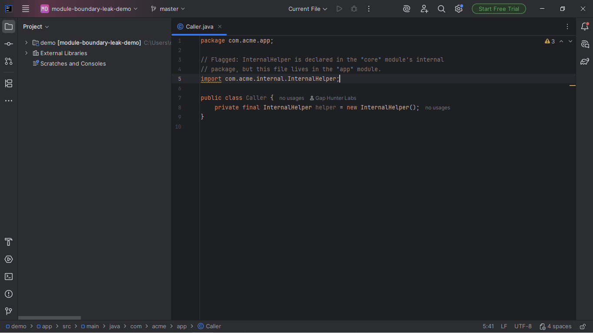
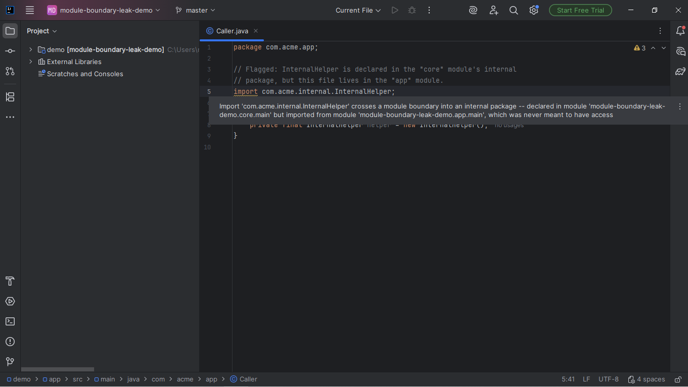

# Module Boundary Leak Companion

Warning on an `import` of an `internal` package (project convention: a
`.internal.` segment in the package path) from a DIFFERENT Gradle/Maven
module than the one that declares it -- hidden architecture coupling
that, in large monorepos/microservices, precedes cascading-deployment
incidents.

## Screenshots





## Why it exists

A module's "private" internals changing and breaking an undeclared
consumer that should never have had access is a well-known source of
cascading-deployment failures in multi-module projects. The bundled
Package Checker analyzes CVEs of declared dependencies, not internal
module architecture; no dedicated Marketplace plugin for this specific
check was found.

## Why built this way

- **Real PSI reference resolution, not a global index lookup** --
  each import is resolved via `PsiImportStatement.resolve()` against
  the file's own AST, rather than `JavaPsiFacade.findClass` against a
  global search scope. Faster in the live editor, and doesn't require
  the project's index to be fully "smart" before it can answer.
- **Real platform module resolution** -- the module graph IntelliJ
  already imported from your real Gradle/Maven project
  (`ModuleUtilCore.findModuleForFile`), not a second hand-rolled parser
  of `settings.gradle.kts`/`pom.xml`.

## v0.1 scope — stated honestly, not exhaustively

- Java only (`PsiJavaFile`/`PsiImportStatement`) -- Kotlin's own import
  PSI is a separate hierarchy, out of scope for this version.
- A single multi-module Gradle OR Maven project (not both build
  systems mixed in the same analysis).
- The "internal" convention must be a literal `.internal.` package
  segment -- never inferred from a javadoc/comment.
- Never resolves a `RoleBinding`-style consumer list; only flags the
  import site itself.
- See `KNOWN_ISSUES.md` for an honest note on this version's
  cross-module test coverage gap.

## Usage

Open any Java file in a multi-module project. An import of an
`internal`-package class declared in a different module than the
importing file shows a warning on the import line.

## Enterprise / Team Licensing

Need enterprise features, custom rules, or team licensing? Contact us at
**gaphunterlabs@gmail.com**.

## Development

```
./gradlew test           # unit tests
./gradlew buildPlugin    # generates build/distributions/*.zip
./gradlew verifyPlugin   # checks compatibility against real IDEs
```

## License

Apache-2.0. See `LICENSE`.
